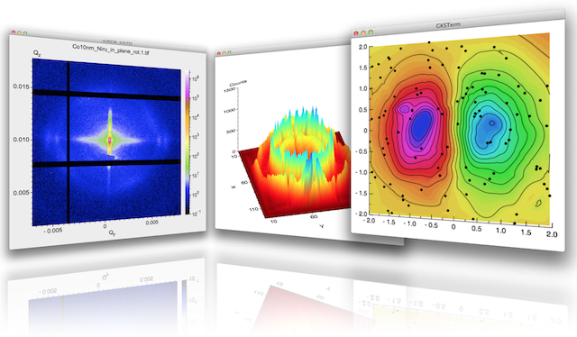
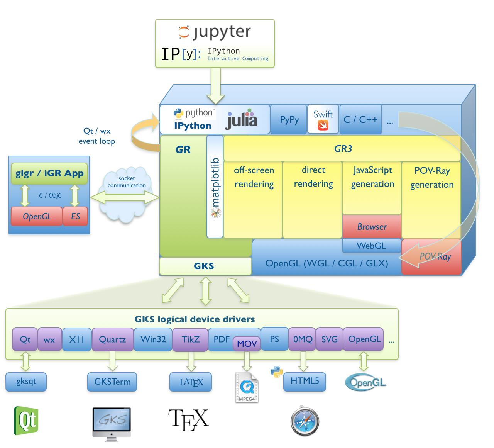
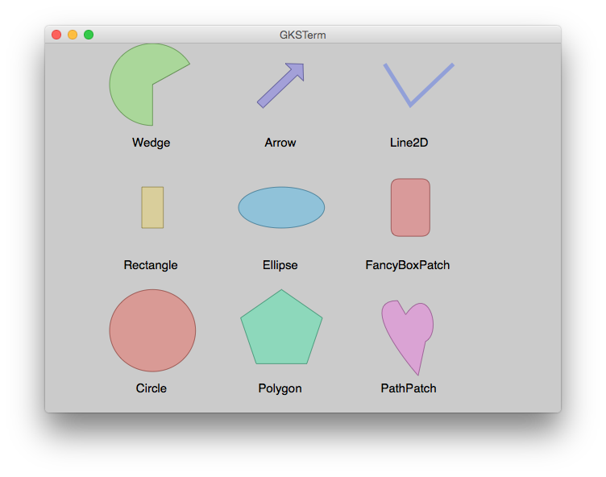

# Introduction to GR

*GR* is a universal framework for cross-platform visualization applications.
It offers developers a compact, portable and consistent graphics library for
their programs. Applications range from publication quality 2D graphs to the
representation of complex 3D scenes.



----

*GR* is essentially based on an implementation of a Graphical Kernel System (GKS)
and *OpenGL*. As a self-contained system it can quickly and easily be integrated
into existing applications (i.e. using the ``ctypes`` mechanism in
[Python](http://python.org) or direct calls from
[Julia](http://julialang.org) with ``ccall`` syntax).

The *GR* framework can be used in imperative programming systems or integrated
into modern object-oriented systems, in particular those based on GUI toolkits.
*GR* is characterized by its high interoperability and can be used with modern
web technologies and mobile devices. The *GR* framework is especially suitable
for real-time environments.



*GR* was developed by the [Scientific IT-Systems](https://pgi-jcns.fz-juelich.de)
group at the [Peter Grünberg Institute](http://www.fz-juelich.de/pgi) at
[Forschunsgzentrum Jülich](http://www.fz-juelich.de). The main development has
been done by Josef Heinen who currently maintains the software.

*GR3* is a software library for simple visualization of 3D scenes.
It was developed by Florian Rhiem as part of his bachelor's thesis.
*GR3* is written in C and can also be used from *Python* or *Julia* through
a wrapper module.

## Getting Started

#### Julia

For the Julia programming language an official
[GR.jl](https://github.com/jheinen/GR.jl) package has been registered.
You can add the GR framework to your Julia installation with the
``Pkg.add()`` function:

```julia
Pkg.add("GR")
```

Let's start with a simple example. We generate 10,000 random numbers and
create a histogram. The histogram function automatically chooses an appropriate
number of bins to cover the range of values in x and show the shape of the
underlying distribution.

```julia
 using GR
 histogram(randn(10000))
```


#### Python

For various Linux distributions we provide `.rpm` and `.deb` packages (`python-gr`)
using [openSUSE Build Service](http://build.opensuse.org). Your operating systems
package manager will cope with package dependencies. Please follow the installation
instructions for your operating system described
[here](http://software.opensuse.org/download.html?project=science:gr-framework&package=python-gr).

For Windows and OS X it's highly recommended to use a Python bundle, eg.
[Anaconda](http://continuum.io/downloads). For those systems you can
download and install ready-to-use packages with a single command::

```bash
conda install -c https://conda.anaconda.org/jheinen gr
```

Now, the same result for the histogram example can be achieved in Python:

```python
from numpy.random import randn
from gr.pygr.mlab import *
    
histogram(randn(10000))
```

## Using GR as a backend for Matplotlib

Matplotlib is the most popular graphics library for Python. It is the
workhorse plotting utility of the scientific Python world. However,
depending on the field of application, the software may be reaching
its limits. This is the point where the GR framework will help.

Starting with release 0.6.0 the GR framework can be used as a backend
for Matplotlib and significantly improve the performance of existing 
Matplotlib applications, e.g.:

```bash
python artist_reference.py -dmodule://gr.matplotlib.backend_gr
```

With Matplotlib 1.5 you can set the backend using the ``MPLBACKEND``
environment variable::

```bash
export MPLBACKEND="module://gr.matplotlib.backend_gr"
```

Some of the Matplotlib examples (generated with the GR backend)
are shown below. You don't have to change any line of code and, as you can see,
the results match with the original.

<script language="JavaScript">
var i = 0;
var path = ["artist_reference", "color_cycle_demo", "contourf3d_demo2",
            "ellipse_collection", "gradient_bar", "griddata_demo", "hist",
            "offset_demo", "path_patch_demo", "pcolormesh_levels",
            "polar_bar_demo", "pyplot_mathtext", "surface3d_demo",
            "tex_demo", "tricontour_smooth_delaunay", "trisurf3d_demo",
            "unicode_demo"];

function swapImage()
{
   document.slide.src = "img/matplotlib/" + path[i] + ".png";
   if (i < path.length - 1) i++; else i = 0;
   setTimeout("swapImage()", 5000);
}
window.onload=swapImage;
</script>
   


## Using GR as backend for Plots.jl

``Plots`` is a powerful wrapper around other Julia visualization
"backends", where ``GR`` seems to be one of the favorite ones.
To get an impression how complex visualizations may become
easier with [Plots](https://juliaplots.github.io), take a look at
[these](https://juliaplots.github.io/examples/gr)  examples.

## Notebook examples

Here you can find some interesting Jupyter notebooks written for Python ...

* [Matplotlib animation example](https://pgi-jcns.fz-juelich.de/pub/doc/anim_mpl.html)
* [A molecular dynamics example](https://pgi-jcns.fz-juelich.de/pub/doc/700K_460.html)

... or Julia kernels:

* [Gravitation wave plot detected by the LIGO observatories](https://pgi-jcns.fz-juelich.de/pub/doc/Ligo.html)
* [Animated view of the Riemann Zeta function](https://pgi-jcns.fz-juelich.de/pub/doc/riemann_zeta.html)
* [Mandelbrot set animation](https://pgi-jcns.fz-juelich.de/pub/doc/mandel.html)
* [Julia animating Julia set fractal](https://pgi-jcns.fz-juelich.de/pub/doc/julia.html)
* [Atomic orbitals](https://pgi-jcns.fz-juelich.de/pub/doc/orbitals.html)
* [Visualize small angle detector data](https://pgi-jcns.fz-juelich.de/pub/doc/GALAXI-Example.html)

